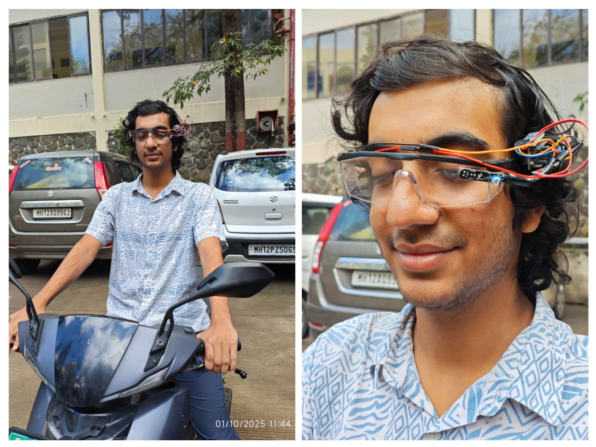

# A Wearable Glasses Based System for Real Time Drowsiness Detection and Accident Prevention.
Accident Prevention Glasses (APGs) detect driver drowsiness using IR sensors to monitor eye blinks and closures. Powered by Arduino Nano and a 13-hour battery, they trigger buzzer and vibration alerts. With Bluetooth and WiFi linked to a Flutter app, APGs offer real-time alerts, SOS, and data logging for enhanced road safety.

---

### Photos

### Videos

---

- Thanku for taking time to check these images and videos.